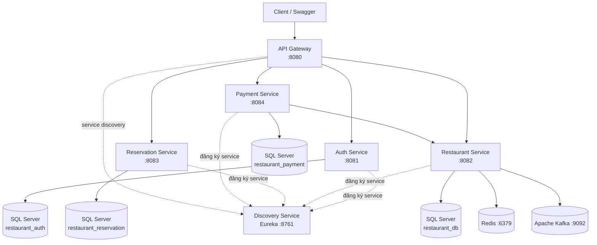

# Quản Lý Nhà Hàng


Hệ thống quản lý nhà hàng được xây dựng theo kiến trúc **Microservices**, sử dụng Spring Boot và các thành phần hỗ trợ cho giao tiếp giữa các service, caching, xử lý bất đồng bộ và khả năng phục hồi.

##  Tổng quan

Project mô phỏng hệ thống backend quản lý nhà hàng với các nghiệp vụ chính:

- Xác thực và phân quyền người dùng
- Quản lý món ăn, loại món, bàn và khu vực
- Quản lý khách hàng và đặt bàn
- Quản lý hóa đơn, chi tiết hóa đơn và thanh toán
- Giao tiếp giữa các service bằng REST và Kafka
- Redis Cache cho dữ liệu thường xuyên truy cập
- Retry, Timeout và Circuit Breaker với Resilience4j
- Swagger/OpenAPI và Spring Boot Actuator

---

##  1. Kiến trúc hệ thống



### Các service

| Service | Port | Chức năng |
|---|---:|---|
| **Discovery Service** | `8761` | Service Discovery bằng Eureka |
| **API Gateway** | `8080` | Cổng vào hệ thống, routing và bảo vệ API |
| **Auth Service** | `8081` | Đăng ký, đăng nhập, JWT, Refresh Token, OTP |
| **Restaurant Service** | `8082` | Quản lý món ăn, loại món, bàn, khu vực |
| **Reservation Service** | `8083` | Quản lý khách hàng và đặt bàn |
| **Payment Service** | `8084` | Quản lý hóa đơn, chi tiết hóa đơn và thanh toán |

### Giao tiếp giữa các service

- **REST API**: sử dụng cho các request cần phản hồi ngay, ví dụ Payment Service gọi Restaurant Service để lấy dữ liệu.
- **Kafka**: sử dụng cho giao tiếp bất đồng bộ và phát hành event giữa các service.
- **Eureka**: giúp các service đăng ký và tìm kiếm service thay vì phụ thuộc cứng vào địa chỉ IP.
- **Redis**: cache dữ liệu thường xuyên được truy cập trong Restaurant Service.
- **Resilience4j**: tăng khả năng chịu lỗi với Retry, Timeout và Circuit Breaker.

### Nguyên tắc database

Mỗi domain/service sử dụng database riêng:

- `restaurant_auth`
- `restaurant_db`
- `restaurant_reservation`
- `restaurant_payment`

Cách tổ chức này giúp giảm coupling và đảm bảo mỗi service sở hữu dữ liệu của domain tương ứng.

---

##  2. Công nghệ sử dụng

| Công nghệ | Mục đích |
|---|---|
| **Java 17** | Ngôn ngữ lập trình |
| **Spring Boot 4.1.0** | Xây dựng backend service |
| **Spring Cloud** | Microservices và Service Discovery |
| **Spring Cloud Gateway** | API Gateway |
| **Netflix Eureka** | Service Discovery |
| **Spring Security + JWT** | Authentication & Authorization |
| **Spring Data JPA** | ORM và truy cập database |
| **SQL Server** | Database |
| **Redis 7** | Caching |
| **Apache Kafka 4.0** | Event-driven communication |
| **Resilience4j** | Retry, Timeout, Circuit Breaker |
| **Swagger / OpenAPI** | Tài liệu và kiểm thử API |
| **Actuator** | Health check và metrics |
| **Docker Compose** | Chạy infrastructure và các service |
| **Maven** | Build và quản lý dependency |

---

##  3. Cách chạy project

### 3.1. Yêu cầu môi trường

Cài đặt:

- Java 17
- Maven
- Docker Desktop
- SQL Server
- Git

Kiểm tra Java:

```bash
java -version
```

Kiểm tra Maven:

```bash
mvn -version
```

### 3.2. Clone project

```bash
git clone https://github.com/trungkien2k5/QuanLyNhaHang.git
cd QuanLyNhaHang
```

### 3.3. Chuẩn bị SQL Server

Project hiện sử dụng SQL Server chạy bên ngoài Docker.

Tạo các database:

```sql
CREATE DATABASE restaurant_auth;
CREATE DATABASE restaurant_db;
CREATE DATABASE restaurant_reservation;
CREATE DATABASE restaurant_payment;
```

Đảm bảo SQL Server đang chạy tại:

```text
localhost:1433
```

### 3.4. Cấu hình Environment Variables

Thiết lập các biến môi trường trước khi chạy project.

```text
DB_USERNAME=your_sqlserver_username
DB_PASSWORD=your_sqlserver_password
JWT_SECRET=your_jwt_secret
MAIL_USERNAME=your_email@gmail.com
MAIL_PASSWORD=your_gmail_app_password
REDIS_HOST=localhost
REDIS_PORT=6379
KAFKA_BOOTSTRAP_SERVERS=localhost:9092
```

Chi tiết xem phần [Environment Variables](#-5-environment-variables).

### 3.5. Khởi động bằng Docker Compose

Build và khởi động toàn bộ service:

```bash
docker compose up -d --build
```

Kiểm tra container:

```bash
docker compose ps
```

Xem log:

```bash
docker compose logs -f
```

Dừng hệ thống:

```bash
docker compose down
```

### 3.6. Thứ tự khởi động

Hệ thống gồm các thành phần chính:

```text
SQL Server
   ↓
Discovery Service
   ↓
Redis + Kafka
   ↓
Auth / Restaurant / Reservation / Payment
   ↓
API Gateway
```

Docker Compose đã khai báo dependency giữa các container. Tuy nhiên, SQL Server cần được chạy sẵn trên máy host vì SQL Server không nằm trong `docker-compose.yml`.

---

##  4. Demo Swagger / API

### Swagger UI

| Service | Swagger UI |
|---|---|
| Auth Service | http://localhost:8081/swagger-ui.html |
| Restaurant Service | http://localhost:8082/swagger-ui.html |
| Reservation Service | http://localhost:8083/swagger-ui.html |
| Payment Service | http://localhost:8084/swagger-ui.html |

### OpenAPI

Ví dụ Restaurant Service:

```text
http://localhost:8082/v3/api-docs
```

### Actuator

Restaurant Service expose các endpoint health và metrics:

```text
http://localhost:8082/actuator/health
http://localhost:8082/actuator/metrics
http://localhost:8082/actuator/prometheus
```

### Luồng test Authentication

```text
1. Register
   ↓
2. Login
   ↓
3. Nhận Access Token
   ↓
4. Mở Swagger
   ↓
5. Chọn Authorize
   ↓
6. Nhập: Bearer <ACCESS_TOKEN>
   ↓
7. Gọi các API yêu cầu authentication
```

### Một số API chính

#### Auth Service

```http
POST /auth/register
POST /auth/login
POST /auth/refresh
POST /auth/logout
PUT  /auth/change-password
```

#### Restaurant Service

```http
GET    /monan
POST   /monan
PUT    /monan/{id}
DELETE /monan/{id}

GET    /ban
GET    /khuvuc
GET    /loaimon
```

#### Reservation Service

```http
POST /datban
GET  /datban
GET  /datban/{id}
PUT  /datban/{id}/cancel
```

#### Payment Service

```http
GET  /hoadon
POST /hoadon
PUT  /hoadon/{id}/thanhtoan

CRUD /chitiethoadon
CRUD /giaodich
```

---

##  5. Environment Variables

Project sử dụng Environment Variables cho các thông tin cấu hình và thông tin nhạy cảm.

| Biến | Bắt buộc | Mục đích |
|---|:---:|---|
| `DB_USERNAME` | ✅ | Username SQL Server |
| `DB_PASSWORD` | ✅ | Password SQL Server |
| `JWT_SECRET` | ✅ | Secret dùng để ký JWT |
| `MAIL_USERNAME` | ✅ | Email gửi OTP/thông báo |
| `MAIL_PASSWORD` | ✅ | App Password của email |
| `REDIS_HOST` | ⭕ | Host Redis, mặc định `localhost` |
| `REDIS_PORT` | ⭕ | Port Redis, mặc định `6379` |
| `KAFKA_BOOTSTRAP_SERVERS` | ⭕ | Kafka server, mặc định `localhost:9092` |

### Ví dụ cấu hình

```env
DB_USERNAME=sa
DB_PASSWORD=your_password

JWT_SECRET=your_long_random_secret

MAIL_USERNAME=your_email@gmail.com
MAIL_PASSWORD=your_gmail_app_password

REDIS_HOST=localhost
REDIS_PORT=6379

KAFKA_BOOTSTRAP_SERVERS=localhost:9092
```

> Không commit password, JWT secret hoặc thông tin email thật lên GitHub.

---

##  6. Cấu trúc project

```text
QuanLyNhaHang/
├── api-gateway/
├── auth-service/
├── discovery-service/
├── restaurant-service/
├── reservation-service/
├── payment-service/
├── docker-compose.yml
├── CONVENTION.md
├── WORKFLOW.md
└── README.md
```

Mỗi service được tổ chức độc lập và có `pom.xml`, Dockerfile và source code riêng.

---

##  7. Authentication & Authorization

Hệ thống sử dụng:

- Spring Security
- JWT Access Token
- Refresh Token
- RBAC (Role-Based Access Control)
- `@PreAuthorize` cho phân quyền endpoint
- OTP qua email

API Gateway sử dụng JWT Secret để kiểm tra token trước khi request đi tới các service phía sau.

---

##  8. Caching & Event-driven

### Redis

Restaurant Service sử dụng Redis làm cache với TTL mặc định **10 phút**.

Cache được sử dụng nhằm giảm số lần truy vấn database đối với dữ liệu được truy cập thường xuyên. Khi dữ liệu thay đổi, cache eviction được sử dụng để tránh trả về dữ liệu cũ.

### Kafka

Kafka được sử dụng cho xử lý event bất đồng bộ.

Lợi ích chính:

- Giảm coupling giữa các service
- Không cần service gọi phải chờ toàn bộ xử lý phía service nhận
- Hỗ trợ xử lý event và retry
- Tăng khả năng mở rộng hệ thống

Kafka trong project chạy theo mô hình **KRaft**, không cần Zookeeper.

---

##  9. Khả năng chịu lỗi

Restaurant Service cấu hình Resilience4j cho Kafka Publisher:

- **Retry**: tối đa 3 lần
- **Timeout**: 3 giây
- **Circuit Breaker**: mở khi tỷ lệ lỗi đạt ngưỡng 50%
- **Wait duration** khi Circuit Breaker mở: 10 giây

Mục tiêu là tránh việc một dependency lỗi kéo theo việc toàn bộ request bị treo hoặc lan truyền lỗi sang các thành phần khác.

---

##  10. Monitoring

Spring Boot Actuator được sử dụng để cung cấp:

- Health check
- Metrics
- Prometheus endpoint

Ví dụ:

```text
/actuator/health
/actuator/metrics
/actuator/prometheus
```

---

##  11. Infrastructure

`docker-compose.yml` cung cấp:

- Discovery Service
- API Gateway
- Auth Service
- Restaurant Service
- Reservation Service
- Payment Service
- Redis 7
- Apache Kafka 4.0

SQL Server hiện chạy trên host machine và được các container kết nối thông qua `host.docker.internal`.

---

##  12. Lưu ý

- Cần khởi động SQL Server trước khi chạy các service.
- Các database phải tồn tại đúng tên cấu hình.
- `DB_USERNAME`, `DB_PASSWORD` và `JWT_SECRET` phải được cấu hình trước khi chạy Docker Compose.
- Email cần sử dụng App Password nếu bật xác thực 2 bước trên Gmail.
- Không commit các secret vào repository.

---

##  Tác giả

**Trung Kiên**

GitHub: https://github.com/trungkien2k5
