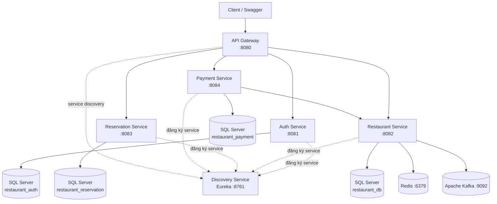

# Quản Lý Nhà Hàng

Hệ thống quản lý nhà hàng được xây dựng theo kiến trúc **Microservices**, sử dụng Spring Boot và các thành phần hỗ trợ cho giao tiếp giữa các service, caching, xử lý bất đồng bộ và khả năng phục hồi.

##  Tổng quan

Project mô phỏng hệ thống backend quản lý nhà hàng với các nghiệp vụ chính:

- Xác thực và phân quyền người dùng
- Quản lý món ăn, loại món, bàn và khu vực
- Quản lý khách hàng và đặt bàn
- Quản lý hóa đơn, chi tiết hóa đơn và thanh toán
- Giao tiếp giữa các service bằng REST và Kafka
- Redis Cache cho dữ liệu thường xuyên truy cập
- Retry, Timeout và Circuit Breaker với Resilience4j
- Swagger/OpenAPI và Spring Boot Actuator

---

##  1. Kiến trúc hệ thống



### Các service

| Service | Port | Chức năng |
|---|---:|---|
| **Discovery Service** | `8761` | Service Discovery bằng Eureka |
| **API Gateway** | `8080` | Cổng vào hệ thống, routing và bảo vệ API |
| **Auth Service** | `8081` | Đăng ký, đăng nhập, JWT, Refresh Token, OTP |
| **Restaurant Service** | `8082` | Quản lý món ăn, loại món, bàn, khu vực |
| **Reservation Service** | `8083` | Quản lý khách hàng và đặt bàn |
| **Payment Service** | `8084` | Quản lý hóa đơn, chi tiết hóa đơn và thanh toán |

### Giao tiếp giữa các service

- **REST API**: sử dụng cho các request cần phản hồi ngay, ví dụ Payment Service gọi Restaurant Service để lấy dữ liệu.
- **Kafka**: sử dụng cho giao tiếp bất đồng bộ và phát hành event giữa các service.
- **Eureka**: giúp các service đăng ký và tìm kiếm service thay vì phụ thuộc cứng vào địa chỉ IP.
- **Redis**: cache dữ liệu thường xuyên được truy cập trong Restaurant Service.
- **Resilience4j**: tăng khả năng chịu lỗi với Retry, Timeout và Circuit Breaker.

### Nguyên tắc database

Mỗi domain/service sử dụng database riêng:

- `restaurant_auth`
- `restaurant_db`
- `restaurant_reservation`
- `restaurant_payment`

Cách tổ chức này giúp giảm coupling và đảm bảo mỗi service sở hữu dữ liệu của domain tương ứng.

---

##  2. Công nghệ sử dụng

| Công nghệ | Mục đích |
|---|---|
| **Java 17** | Ngôn ngữ lập trình |
| **Spring Boot 4.1.0** | Xây dựng backend service |
| **Spring Cloud** | Microservices và Service Discovery |
| **Spring Cloud Gateway** | API Gateway |
| **Netflix Eureka** | Service Discovery |
| **Spring Security + JWT** | Authentication & Authorization |
| **Spring Data JPA** | ORM và truy cập database |
| **SQL Server** | Database |
| **Redis 7** | Caching |
| **Apache Kafka 4.0** | Event-driven communication |
| **Resilience4j** | Retry, Timeout, Circuit Breaker |
| **Swagger / OpenAPI** | Tài liệu và kiểm thử API |
| **Actuator** | Health check và metrics |
| **Docker Compose** | Chạy infrastructure |
| **Maven** | Build và quản lý dependency |

---

##  3. Cách chạy project

### 3.1. Yêu cầu môi trường

Cài đặt:

- Java 17
- Maven
- Docker Desktop
- Git

Kiểm tra Java:

```bash
java -version
```

Kiểm tra Maven:

```bash
mvn -version
```

### 3.2. Clone project

```bash
git clone https://github.com/trungkien2k5/QuanLyNhaHang.git
cd QuanLyNhaHang
```

### 3.3. Chuẩn bị Environment Variables

Thiết lập các biến môi trường trước khi chạy project.

```text
DB_USERNAME=sa
DB_PASSWORD=your_strong_password
JWT_SECRET=your_jwt_secret
MAIL_USERNAME=your_email@gmail.com
MAIL_PASSWORD=your_gmail_app_password
REDIS_HOST=localhost
REDIS_PORT=6379
KAFKA_BOOTSTRAP_SERVERS=localhost:9092
```

> `DB_PASSWORD` phải đáp ứng chính sách mật khẩu của SQL Server.

### 3.4. Khởi động Infrastructure bằng Docker

Docker Compose chỉ chạy **Infrastructure**, còn các Spring Boot service chạy trực tiếp bằng IntelliJ:

```text
Docker Desktop
├── SQL Server :1433
├── Redis :6379
└── Kafka :9092

IntelliJ
├── discovery-service :8761
├── auth-service :8081
├── restaurant-service :8082
├── reservation-service :8083
├── payment-service :8084
└── api-gateway :8080
```

Khởi động:

```bash
docker compose up -d
```

Kiểm tra:

```bash
docker compose ps
```

Xem log:

```bash
docker compose logs -f
```

Dừng infrastructure:

```bash
docker compose down
```

SQL Server tự tạo các database:

```text
restaurant_auth
restaurant_db
restaurant_reservation
restaurant_payment
```

script khởi tạo nằm tại `db/init.sql`.

### 3.5. Chạy Spring Boot bằng IntelliJ

Chạy theo thứ tự:

```text
1. discovery-service
2. auth-service
3. restaurant-service
4. reservation-service
5. payment-service
6. api-gateway
```

Khi sửa code Java, chỉ cần **Restart service trong IntelliJ**. Không cần build lại Docker image.

---

##  4. Demo Swagger / API

### Swagger UI

| Service | Swagger UI |
|---|---|
| Auth Service | http://localhost:8081/swagger-ui.html |
| Restaurant Service | http://localhost:8082/swagger-ui.html |
| Reservation Service | http://localhost:8083/swagger-ui.html |
| Payment Service | http://localhost:8084/swagger-ui.html |

### OpenAPI

Ví dụ Restaurant Service:

```text
http://localhost:8082/v3/api-docs
```

### Actuator

Restaurant Service expose các endpoint health và metrics:

```text
http://localhost:8082/actuator/health
http://localhost:8082/actuator/metrics
http://localhost:8082/actuator/prometheus
```

---

##  5. Environment Variables

| Biến | Bắt buộc | Mục đích |
|---|:---:|---|
| `DB_USERNAME` | ✅ | Username SQL Server, thông thường là `sa` |
| `DB_PASSWORD` | ✅ | Password SQL Server và password của container SQL Server |
| `JWT_SECRET` | ✅ | Secret dùng để ký JWT |
| `MAIL_USERNAME` | ✅ | Email gửi OTP/thông báo |
| `MAIL_PASSWORD` | ✅ | App Password của email |
| `REDIS_HOST` | ⭕ | Host Redis, mặc định `localhost` |
| `REDIS_PORT` | ⭕ | Port Redis, mặc định `6379` |
| `KAFKA_BOOTSTRAP_SERVERS` | ⭕ | Kafka server, mặc định `localhost:9092` |

> Không commit password, JWT secret hoặc thông tin email thật lên GitHub.

---

##  6. Cấu trúc project

```text
QuanLyNhaHang/
├── api-gateway/
├── auth-service/
├── discovery-service/
├── restaurant-service/
├── reservation-service/
├── payment-service/
├── db/
│   └── init.sql
├── docker-compose.yml
├── CONVENTION.md
├── WORKFLOW.md
└── README.md
```

---

##  7. Authentication & Authorization

Hệ thống sử dụng:

- Spring Security
- JWT Access Token
- Refresh Token
- RBAC (Role-Based Access Control)
- `@PreAuthorize` cho phân quyền endpoint
- OTP qua email

---

##  8. Caching & Event-driven

### Redis

Restaurant Service sử dụng Redis làm cache với TTL mặc định **10 phút**.

### Kafka

Kafka được sử dụng cho xử lý event bất đồng bộ.

Kafka trong project chạy theo mô hình **KRaft**, không cần Zookeeper.

---

##  9. Khả năng chịu lỗi

Restaurant Service cấu hình Resilience4j cho Kafka Publisher:

- **Retry**: tối đa 3 lần
- **Timeout**: 3 giây
- **Circuit Breaker**: mở khi tỷ lệ lỗi đạt ngưỡng 50%
- **Wait duration** khi Circuit Breaker mở: 10 giây

---

##  10. Monitoring

Spring Boot Actuator được sử dụng để cung cấp health check, metrics và Prometheus endpoint.

---

##  11. Infrastructure

`docker-compose.yml` cung cấp:

- SQL Server 2022 Developer
- Redis 7
- Apache Kafka 4.0

Các Spring Boot service không còn chạy trong Docker Compose; chúng chạy trực tiếp bằng IntelliJ để việc sửa code và restart service nhanh hơn.

SQL Server dùng volume `sqlserver-data`, Redis dùng `redis-data` để giữ dữ liệu khi container được recreate.

---

##  12. Lưu ý

- Cấu hình `DB_PASSWORD` giống nhau cho Docker SQL Server và biến môi trường của các Spring Boot service.
- SQL Server được expose tại `localhost:1433` nên các service chạy bằng IntelliJ vẫn kết nối qua `localhost`.
- Không commit các secret vào repository.
- Nếu đã có dữ liệu trong SQL Server cài trên Windows trước đây, dữ liệu đó **không tự động được migrate** sang volume Docker mới; cần backup/restore nếu muốn giữ dữ liệu cũ.

---

##  Tác giả

**Trung Kiên**

GitHub: https://github.com/trungkien2k5
